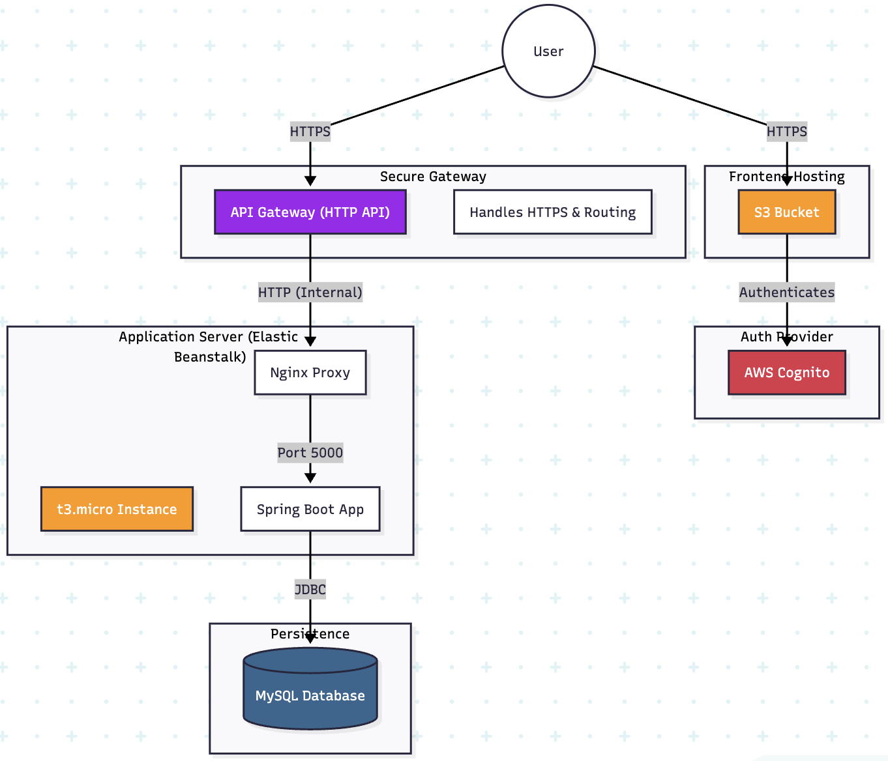

# Cloud Architecture Diagram


# Instructions to run the Application Locally
make sure you inject those environment variables in your local environment before running the application:

```bash
export DATABASE_URL="your_database_url
```

# Instructions to push the application to your AWS Environment

you must create in the infrastructure folder a file called `terraform.tfvars` and inject the following variables:

```bash
cd infrastructure
touch terraform.tfvars
```

```terraform
db_username          = "your_choosen_username"
db_password          = "your_choosen_password"
security_group_id    = "your_security_group_id"
db_subnet_group_name = "your_db_subnet_group_name"
```

```bash
terraform init
```

```bash
terraform plan
```

```bash
terraform deploy --auto-approve
```

```bash
terraform destroy --auto-approve
```
