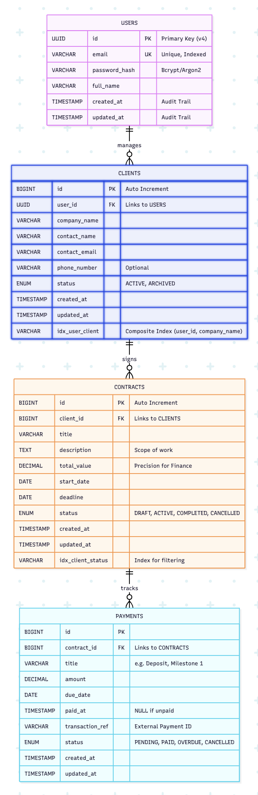

# ClientLedger 📒

**ClientLedger** is a focused SaaS solution designed to solve the administrative chaos faced by freelancers and small agencies. It transforms the messy reality of freelance work—scattered WhatsApp agreements, forgotten payment deadlines, and messy Excel sheets—into a streamlined, professional system of record.

---

## 🧐 Why It Matters
Freelancers are experts in their craft (coding, design, writing), but often amateurs at administration. They face three critical pain points:

* **💸 Revenue Leakage:** Money is lost because follow-ups on unpaid invoices are forgotten or delayed.
* **⚖️ Scope Creep & Disputes:** Agreements made informally on WhatsApp or email are hard to reference later. "I thought this was included" disputes cost time and money.
* **🧾 Unprofessional Workflows:** Managing million-dollar skills with messy spreadsheets or text messages damages client trust.

## 🟢 The Solution
A centralized dashboard that acts as the **Single Source of Truth** for every client interaction.
* It’s not just an invoice generator; it is a **Contract Lifecycle Manager**.
* It’s not just a to-do list; it is a **Financial Health Monitor**.

---

## 🛠 Tech Stack

| Layer | Technology |
| :--- | :--- |
| **Frontend** | Next.js (React) |
| **Backend** | Java Spring Boot |
| **Database** | AWS RDS (MySQL) |
| **Infrastructure** | Terraform (IaC) |
| **Deployment** | AWS Cloud with GitHub Actions CI/CD |

---

## 🏗 Architecture

### Cloud Architecture


### Database MVP Schema


---

## 🚀 Deployment Instructions

### 0. Prerequisites (GitHub Secrets)
To allow GitHub Actions to deploy the project automatically:

1.  Create an **IAM User** in AWS with programmatic access.
2.  Copy the `Access Key ID` and `Secret Access Key`.
3.  Go to your GitHub Repository > **Settings** > **Secrets and variables** > **Actions**.
4.  Add the following secrets:
    * `AWS_ACCESS_KEY_ID`
    * `AWS_SECRET_ACCESS_KEY`

### 1. Configure Terraform
Navigate to the `infrastructure` directory and create the variable definitions file.

```bash
cd infrastructure
touch terraform.tfvars
```

Add the following variables to terraform.tfvars:

```tf
db_username = "your_chosen_username"
db_password = "your_chosen_password"
```

### 2. Deploy Infrastructure
Initialize and apply the Terraform configuration to create the AWS environment (VPC, RDS, Beanstalk, S3, Cognito).

```bash
# Initialize Terraform
terraform init

# Review the plan
terraform plan

# Apply the infrastructure
terraform apply --auto-approve
```

### 3. Configure Production Environment
Once terraform apply completes, you will see a list of outputs in your terminal (e.g., NEXT_PUBLIC_API_URL, NEXT_PUBLIC_COGNITO_USER_POOL_ID).

1. Copy ALL outputs that start with NEXT_PUBLIC_.

2. Go to GitHub Secrets (Settings > Secrets and variables > Actions).

3. Create a single new secret named PROD_ENV_FILE.

4. Paste the copied outputs into this secret.

### 4. Deploy Application (CI/CD)
Now that the infrastructure is ready and secrets are set:

1. 1Navigate to the Actions tab in GitHub.

2. Select the Deploy Backend to AWS workflow and click Run workflow.

3. Select the Deploy Frontend to S3 workflow and click Run workflow.

## ⚠️ Teardown
To destroy the infrastructure and stop billing:
```bash
cd infrastructure
terraform destroy --auto-approve
```
